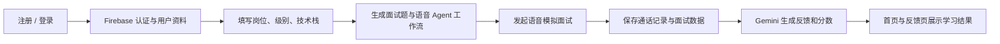

# AI Mock Interview System：中文项目学习讲义

> 视频来源：YouTube `8GK8R77Bd7g`。本讲义依据视频的英文自动字幕整理而成，用于帮助你按项目流程学习；它不是逐字字幕翻译。

## 1. 这个项目最终做什么？

你要做的是一个 **AI 模拟面试平台**：用户登录后，可以生成特定岗位、级别和技术栈的面试；与语音 AI 面试官进行真实通话；结束后获得 AI 生成的评分和改进建议。

核心不是“把页面做出来”，而是打通下面这一条业务闭环：

## 2. 先看全局路线（建议严格按此顺序）

| 时间 | 阶段 | 完成后应该看到什么 |
| --- | --- | --- |
| 00:00–10:00 | 项目演示与初始化 | 明确成品功能，创建 Next.js 工程 |
| 10:00–20:00 | 基础工程与样式 | TypeScript、ESLint、Tailwind、全局样式与资源准备好 |
| 20:00–30:00 | 路由与页面骨架 | 登录页和带导航栏的应用页使用不同布局 |
| 30:00–50:00 | UI 与认证表单 | 首页卡片、通用输入框、注册/登录表单可用 |
| 50:00–80:00 | 首页与面试卡片 | 能用假数据展示“你的面试”和“推荐面试” |
| 80:00–110:00 | Firebase 身份认证 | 注册、登录、会话 Cookie、用户资料写入成功 |
| 110:00–140:00 | 面试通话界面 | 具备 AI 面试官、用户状态和对话文本的界面 |
| 140:00–170:00 | 生成面试的 AI 工作流 | 可以创建带岗位/技术栈上下文的语音 Agent |
| 170:00–200:00 | 通话与数据保存 | 通话结束后，生成的面试能回到首页显示 |
| 200:00–230:00 | 反馈系统 | 通话记录交给 Gemini，生成分数、优点和建议 |
| 230:00–结束 | 部署与验收 | 部署到 Vercel，线上环境变量配置完成 |

## 3. 第一阶段：搭建前端骨架（00:00–50:00）

### 3.1 初始化项目

用最新版 Next.js 创建项目时，视频选择了：TypeScript、ESLint、Tailwind CSS，并且不使用单独的 `src` 目录。完成后先运行开发服务器，确认默认页面可以打开，再开始改代码。

学习重点：

- TypeScript 负责限制数据类型，避免把“面试对象”“用户对象”“反馈对象”混在一起。
- Tailwind 负责快速实现卡片、间距、响应式布局。
- ESLint 用于及早发现未使用变量和潜在错误。

### 3.2 用路由组拆开两种布局

项目有两类页面：

1. **公开页**：登录、注册等，不需要顶部导航。
2. **应用页**：首页、面试详情、反馈页等，需要统一导航栏。

视频将需要导航的页面放进一个路由组中，并把根页面移动进去，以避免两个页面同时对应 `/` 路径产生冲突。

你的检查点：访问登录页时不显示应用导航；登录后访问首页时显示导航，且两个页面各自布局正确。

### 3.3 先组件化，再精修样式

优先拆出这些可复用组件：

- `Navbar`：登录用户信息、导航入口。
- `Input` / `FormField`：统一输入、标签、错误状态。
- `InterviewCard`：统一显示岗位、技术栈、日期、评分和操作按钮。
- `Agent`：复用“创建面试”和“参加面试”两种通话模式。

不要一开始把所有 JSX 写在首页。视频后面要在多个区域重复渲染面试卡片；组件化能避免以后修改样式时到处复制粘贴。

## 4. 第二阶段：先用假数据完成产品体验（50:00–80:00）

在接 Firebase 前，先准备若干模拟面试数据。首页至少分为两块：

- **Your interviews**：当前用户已经生成或参与过的面试。
- **Take an interview**：可直接练习的推荐面试。

`InterviewCard` 应处理两种状态：

- 有反馈：显示总分（满分 100）和“查看反馈”。
- 尚未完成：总分显示占位符，按钮引导用户开始面试。

这一阶段的关键原则：**先把信息架构和交互跑通，再接真实后端。** 当假数据页面已经舒服，后面替换为 Firestore 数据会简单很多。

## 5. 第三阶段：Firebase 认证与数据层（80:00–120:00）

### 5.1 为什么同时需要 Client SDK 和 Admin SDK？

- **Client SDK**：浏览器端注册、登录、读取当前用户。
- **Admin SDK**：服务端创建会话 Cookie、执行可信的数据库写入与读取。

不要在客户端暴露管理员凭证；管理员操作应只放在服务端代码或 Server Action 中。

### 5.2 完成认证闭环

按下面顺序实现并逐个测试：

1. Firebase 控制台启用邮箱/密码登录。
2. 注册用户。
3. 在 Firestore 创建对应用户文档。
4. 用 ID Token 创建时长约一周的服务端会话 Cookie。
5. 登录后跳转首页。
6. 服务端读取 Cookie，获取当前用户；未登录则重定向登录页。
7. 退出时清除会话。

验收方式：注册一个测试账户后，在 Firebase Authentication 中能看到该账户；在 Firestore 中能看到相应资料；刷新浏览器后仍保持登录。

### 5.3 数据模型先定好

至少准备三类数据：

| 数据 | 关键字段 |
| --- | --- |
| User | `id`、姓名、邮箱、头像/照片地址 |
| Interview | `id`、`userId`、类型、岗位、级别、技术栈、题目、是否完成、创建时间 |
| Feedback | `interviewId`、`userId`、总分、维度分数、优点、待改进项、最终建议 |

每次查询都应带上 `userId`，不能让用户读取其他人的面试和反馈。

## 6. 第四阶段：AI 面试通话体验（120:00–170:00）

### 6.1 先做“看起来像通话”的页面

通话页包含：AI 面试官头像和说话动效、用户头像、当前通话状态、实时消息文字，以及开始/结束按钮。先把状态切换做好：`inactive → connecting → active → finished`。

这样即使语音服务尚未接入，你也可以先验证按钮、动画和页面跳转。

### 6.2 创建面试与参加面试复用同一个 Agent

视频中的 Agent 组件有两种用途：

- `generate`：收集岗位、级别、技术栈、题数和用户 ID，让 AI 生成一场面试。
- `interview`：读取已保存的面试题，真正向用户提问。

因此调用接口时要传清楚上下文：面试类型、岗位、级别、技术栈、题目数量、用户 ID。服务端先校验参数，再创建/调用 AI 工作流；异常必须返回明确的失败状态，而不是让前端一直加载。

### 6.3 Vapi 工作流的核心思路

在 Vapi 中创建语音 Agent，并定义流程：开场白 → 逐题提问 → 根据用户回答追问 → 结束通话。把应用部署地址设置成环境变量，让工作流在需要时可以回调你的 Next.js 接口。

不要把 API Key、Firebase 私钥、Vapi 凭证或 Gemini Key 提交到 Git。只写进 `.env.local` 和部署平台的环境变量配置。

## 7. 第五阶段：保存面试、生成反馈（170:00–230:00）

### 7.1 通话结束时做什么？

当通话状态变为 `finished`：

1. 结束本地 UI 的录音/通话状态。
2. 收集对话记录或通话摘要。
3. 将生成的面试或通话结果写入 Firestore。
4. 导航回首页，让用户看到新面试。

视频中特意先跳回首页，而不是立刻跳转面试详情：因为生成/写入可能需要一点时间，首页是更稳定的回落位置。

### 7.2 用 Gemini 输出可执行反馈

反馈生成函数的输入至少包含 `interviewId`、`userId` 和通话内容。提示词应要求模型返回稳定的结构，例如：

- 总分（0–100）
- 每个评估维度的分数和解释
- 回答做得好的地方
- 需要改善的地方
- 下一次练习的具体动作

拿到模型结果后先校验结构，再写入 Feedback 集合。反馈页只负责读取并展示，不应在每次刷新时重新请求模型，否则会造成重复费用和结果漂移。

## 8. 部署前检查清单

- [ ] 本地注册、登录、退出和刷新会话都正常。
- [ ] 未登录用户无法访问首页、面试页、反馈页。
- [ ] 一个用户不能读取另一个用户的 Firestore 数据。
- [ ] 生成面试后，首页能显示新卡片。
- [ ] 通话结束后，记录与反馈能正确关联同一个 `interviewId`。
- [ ] 所有密钥都只在环境变量中；仓库内没有真实凭证。
- [ ] Vercel 已设置 Firebase、Vapi、Gemini 和站点 URL 等环境变量，修改后重新部署。

## 9. 最容易卡住的地方

1. **根路由冲突**：路由组移动页面后，确保只有一个页面对应 `/`。
2. **Firebase 初始化重复**：开发模式热更新可能重复初始化，客户端和服务端初始化代码都要能安全复用实例。
3. **Cookie 不生效**：确认 Cookie 在服务端写入，并在受保护页面的服务端读取。
4. **AI 创建成功但首页没有数据**：检查写入的 `userId`、查询过滤条件和刷新/重新验证逻辑。
5. **反馈无法生成**：先确认通话文本/记录不为空，再检查 Gemini 的返回格式和错误处理。
6. **线上可用、本地不可用或相反**：逐项比较 `.env.local` 与 Vercel 环境变量，尤其是回调 URL。

## 10. 推荐的学习节奏

不要试图一口气复刻近四小时内容。推荐按下面 5 次完成：

1. 第 1 次：初始化、路由、静态首页和卡片。
2. 第 2 次：注册、登录、Firebase 会话。
3. 第 3 次：生成面试页面与语音通话 UI。
4. 第 4 次：Vapi 工作流、保存面试和首页真实数据。
5. 第 5 次：Gemini 反馈、权限检查、部署和完整回归测试。

每完成一次就提交一次 Git。这样当 Firebase、语音 Agent 或环境变量出问题时，你能准确回退到最后一个可运行状态。
